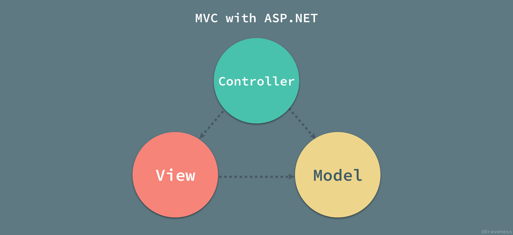

# mvp mvc mvvm

## Model-View-Controller

将整个应用分成 Model、View 和 Controller 三个部分，而这些组成部分其实也有着几乎相同的职责。

视图：管理作为位图展示到屏幕上的图形和文字输出；
控制器：翻译用户的输入并依照用户的输入操作模型和视图；
模型：管理应用的行为和数据，响应数据请求（经常来自视图）和更新状态的指令（经常来自控制器）；

### ASP.NET MVC

可以理解为:

1. 控制器负责管理视图和模型；
2. 视图负责展示模型中的内容；

### JAVA Spring MVC

1. 通过 DispatchServlet 将控制器层和视图层完全解耦；
2. 视图层和模型层之间没有直接关系，只有间接关系，通过控制器对模型进行查询、返回给 DispatchServlet 后再传递至视图层；

### iOS MVC

### Rails MVC

视图层和模型层没有直接的耦合，而是通过控制器作为中间人对信息进行传递：
这种 MVC 的设计分离了视图层和模型层之间的耦合，作为承担数据存储功能的模型层，可以通过控制器同时为多种不同的视图提供数据

### MVC in Wikipedia

它对架构图中的箭头进行了详细的说明，指出了这个关系到底表示什么。

1. 视图被用户看到；
2. 用户使用控制器；
3. 控制器操作模型；
4. 模型更新视图；

### 前端 MVC

当前端/客户端与后端一同工作时，其实分别『部署』了两个不同的应用，这两个应用都遵循 MVC 架构模式：

1. 客户端和服务器通过网络进行连接，并组成了一个更大的 MVC 架构；
2. 从这个角度来看，服务端的模型层才存储了真正的数据，而客户端的模型层只不过是一个存储在客户端设备中的本地缓存和临时数据的集合；
3. 同理，服务端的视图层也不是整个应用的视图层，用于为用户展示数据的视图层位于客户端，也就是整个架构的最顶部
4. 中间的五个部分，也就是从低端的模型层到最上面的视图共同组成了整个应用的控制器，将模型中的数据以合理的方式传递给最上层的视图层用于展示

## MVVM

Model <==> ViewModel <==> View

### PM

### MVVM 的演变

1.  PM
    PM 模式中创建了一个视图的抽象，叫做 Presentation Model，而视图也成为了这个模型的『渲染』结果。
    PM 通过引入展示模型将模型层中的数据与复杂的业务逻辑封装成属性与简单的数据同时暴露给视图，让视图和展示模型中的属性进行同步。
    展示模型中包含所有的视图渲染需要的动态信息，包括视图的内容（text、color）、组件是否启用（enable），除此之外还会将一些方法暴露给视图用于某些事件的响应
    

2.  
    它由三个部分组成: 也就是 Model、View 和 ViewModel；
    其中视图模型（ViewModel）其实就是 PM 模式中的展示模型，在 MVVM 中叫做视图模型。
    除了我们非常熟悉的 Model、View 和 ViewModel 这三个部分，在 MVVM 的实现中，还引入了隐式的一个 Binder 层，而声明式的数据和命令的绑定在 MVVM 模式中就是通过它完成的
    
    无论是 MVVM 还是 Presentation Model，其中最重要的不是如何同步视图和展示模型/视图模型之间的状态，不是使用观察者模式、双向绑定还是其它的机制都不是整个模式中最重要的部分，**最为关键的是展示模型/视图模型创建了一个视图的抽象，将视图中的状态和行为抽离出一个新的抽象，**这才是 MVVM 和 PM 中需要注意的

## MVP

MVP 架构模式是 MVC 的一个变种
两者之间最大的区别就是 MVP 中使用 Presenter 对视图和模型进行了解耦，它们彼此都对对方一无所知，沟通都通过 Presenter 进行

1. 当视图接收到来自用户的事件时，会将事件转交给 Presenter 进行处理；
2. 被动的视图向外界暴露接口，当需要更新视图时 Presenter 通过视图暴露的接口更新视图的内容；
3. Presenter 负责对模型进行操作和更新，在需要时取出其中存储的信息；
4. 当模型层改变时，可以将改变的信息发送给观察者 Presenter；
